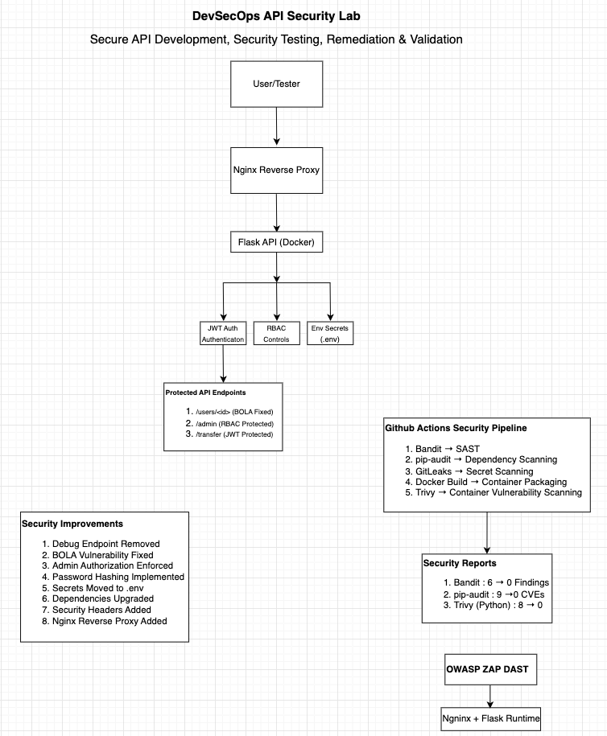

# 🔐 DevSecOps API Security Lab


## Secure API Development, Security Testing, Remediation & Validation

This project demonstrates a complete DevSecOps workflow by building, testing, securing, and validating a vulnerable containerized API.

The project begins with intentionally insecure API endpoints mapped to the **OWASP API Security Top 10** and progresses through vulnerability discovery, automated security scanning, remediation, validation, and security automation using industry-standard DevSecOps tools.

**Full Security Lifecycle Covered:**
```
Vulnerable API → SAST + SCA + Secret Scan + Container Scan + DAST → Remediation → Validation
```

---

## 🎯 Objectives

- Build an intentionally vulnerable Flask API simulating real-world OWASP API Top 10 risks
- Identify security weaknesses using automated SAST, DAST, and supply chain scanning tools
- Remediate discovered vulnerabilities across authentication, authorization, and configuration
- Validate fixes through automated re-testing and before/after comparison
- Implement a fully automated DevSecOps CI/CD security pipeline using GitHub Actions
- Demonstrate Secure Software Development Lifecycle (SSDLC) practices

---

## 🏗️ Architecture



### Architecture Components

| Component | Role |
|---|---|
| User / Tester | Interacts with API via browser or curl |
| Nginx Reverse Proxy | Centralizes security headers, hides framework details |
| Flask API (Docker) | Vulnerable-then-hardened API application |
| JWT Authentication | Secure token-based authentication |
| Role-Based Access Control (RBAC) | Enforces function-level authorization |
| Environment Variable Secret Management | Eliminates hardcoded secrets |
| GitHub Actions Security Pipeline | Automates all security scans on every push |
| OWASP ZAP | Runtime DAST validation |

---

## 🚨 Vulnerabilities Identified

| # | Vulnerability | OWASP API Top 10 | Severity | Status |
|---|---|---|---|---|
| 1 | Broken Object Level Authorization (BOLA) | API1 | Critical | Remediated |
| 2 | Broken Authentication | API2 | Critical | Remediated |
| 3 | Sensitive Data Exposure | API3 | High | Remediated |
| 4 | Missing Rate Limiting | API4 | High | Remediated |
| 5 | Broken Function Level Authorization | API5 | Critical | Remediated |
| 6 | Security Misconfiguration | API8 | High | Remediated |
| 7 | Hardcoded Secrets | API8 | High | Remediated |

---

## ⚔️ Exploitation Phase

### 1. Broken Object Level Authorization (BOLA)

Users could access any other user's records by simply changing the user ID in the request — no authorization check was performed.

**Attack Path:**
```
Authenticated low-privilege user → Modify user ID in request → Access any user's data
```

**Exploit Command:**
```bash
curl http://127.0.0.1:8000/users/2
```

**Impact:**
- Full access to any user's personal data
- No authorization boundary between users
- Mass data enumeration possible

---

### 2. Broken Function Level Authorization

Administrative endpoints were publicly accessible without any role verification.

**Attack Path:**
```
Any user → Access /admin endpoint → Full administrative control
```

**Exploit Command:**
```bash
curl http://127.0.0.1:8000/admin
```

**Impact:**
- Unauthorized access to administrative functions
- Ability to modify or delete any user data
- Complete bypass of access controls

---

### 3. Hardcoded Secrets

JWT secrets and API keys were stored directly in source code — visible to anyone with repository access.

**Attack Path:**
```
Attacker accesses source code → Extracts hardcoded JWT secret → Forges valid tokens → Account takeover
```

**Impact:**
- JWT token forgery
- Complete authentication bypass
- Credential exposure in version control history

---

### 4. Sensitive Data Exposure

Application secrets and user information including plaintext passwords were exposed through insecure endpoints and debug configurations.

---

## 🔍 Security Assessment

### Bandit (SAST — Static Application Security Testing)

Identified:

| Finding | Severity |
|---|---|
| Hardcoded JWT secret in source code | High |
| Debug mode enabled in production | Medium |
| Insecure runtime configuration | Medium |

**Initial Findings: 6**

---

### pip-audit (Software Composition Analysis)

Identified vulnerable dependencies:

| Package | Vulnerability |
|---|---|
| Flask | Known CVEs |
| PyJWT | Known CVEs |
| Werkzeug | Known CVEs |

**Initial Findings: 9**

---

### GitLeaks (Secret Scanning)

Scanned entire repository history for exposed secrets, API keys, and credentials hardcoded in source code.

---

### Trivy (Container Security Scanning)

Identified:

| Finding Type | Count |
|---|---|
| Python package vulnerabilities | Included in 8 total |
| Container OS vulnerabilities | Included in 8 total |

**Initial Findings: 8**

---

### OWASP ZAP (DAST — Dynamic Application Security Testing)

Identified at runtime:

| Finding | Type |
|---|---|
| Missing security headers | Configuration |
| Content Security Policy weaknesses | Configuration |
| Server information disclosure | Information Exposure |

**Initial Findings: 2**

---

## 🛡️ Remediation & Hardening

### 1. Authentication & Authorization

**Actions Taken:**
- Implemented JWT Authentication with secure secret management
- Added authorization middleware to enforce access controls
- Implemented Role-Based Access Control (RBAC) to fix function-level authorization
- Fixed BOLA by validating requesting user against requested resource

**Validation:** BOLA exploit returns `403 Forbidden`. Admin endpoint requires valid admin role token.

---

### 2. Secret Management

Removed all hardcoded secrets from source code and migrated to environment variables:

```python
# Before — hardcoded secret
JWT_SECRET = "supersecretkey123"

# After — environment variable
JWT_SECRET = os.getenv("JWT_SECRET")
```

Using `python-dotenv` for local development. GitLeaks confirmed no secrets in repository history post-remediation.

---

### 3. Password Security

Implemented password hashing using `werkzeug.security` — plaintext passwords eliminated.

---

### 4. Security Headers

Implemented via Nginx reverse proxy:

| Header | Purpose |
|---|---|
| Content-Security-Policy | Prevents XSS attacks |
| X-Content-Type-Options | Prevents MIME sniffing |
| X-Frame-Options | Prevents clickjacking |
| Referrer-Policy | Controls referrer information |

---

### 5. Dependency Remediation

Upgraded all vulnerable packages to patched versions:
- Flask → latest stable
- PyJWT → latest stable
- Werkzeug → latest stable

---

### 6. Nginx Reverse Proxy

Deployed Nginx to:
- Hide application framework details
- Centralize security header enforcement
- Improve production readiness

---

## 📉 Before vs. After Comparison

| Security Control | Before | After |
|---|---|---|
| Bandit SAST Findings | 6 | 0 |
| pip-audit Vulnerabilities | 9 | 0 |
| Trivy Container Vulnerabilities | 8 | 0 |
| OWASP ZAP Findings | 2 | 0 |
| BOLA Vulnerability | Present | Fixed |
| Admin Authorization | Missing | Enforced |
| Hardcoded Secrets | Present | Removed |
| Debug Endpoint | Exposed | Removed |
| Password Storage | Plaintext | Hashed |
| Security Headers | Missing | Implemented |

**Total vulnerabilities eliminated: 25 across all scanning tools**

---

## ⚙️ GitHub Actions Security Pipeline

The CI/CD pipeline automatically runs all security scans on every code push — blocking insecure builds before deployment.

```
Developer Push
      ↓
GitHub Actions Triggered
      ↓
┌─────────────────────────┐
│ 1. Bandit SAST Scan     │ ← Static code analysis
│ 2. pip-audit SCA Scan   │ ← Dependency vulnerabilities
│ 3. GitLeaks Secret Scan │ ← Hardcoded credential detection
│ 4. Docker Image Build   │ ← Containerization
│ 5. Trivy Container Scan │ ← Container vulnerability scan
└─────────────────────────┘
      ↓
Security Gates Pass → Build Proceeds
Security Gates Fail → Build Blocked
```

Pipeline Location:
```
.github/workflows/security-pipeline.yml
```

---

## 🧩 Framework Mapping

### OWASP API Security Top 10

| Vulnerability | OWASP Category | Remediation |
|---|---|---|
| BOLA | API1 — Broken Object Level Authorization | RBAC + resource ownership validation |
| Broken Authentication | API2 — Broken Authentication | JWT hardening + secure secret management |
| Sensitive Data Exposure | API3 — Broken Object Property Level Auth | Output filtering + data minimization |
| Missing Rate Limiting | API4 — Unrestricted Resource Consumption | Flask-Limiter implementation |
| Broken Function Auth | API5 — Broken Function Level Authorization | Role-based middleware enforcement |
| Security Misconfiguration | API8 — Security Misconfiguration | Nginx hardening + secure headers |
| Hardcoded Secrets | API8 — Security Misconfiguration | Environment variable migration |

### NIST Cybersecurity Framework

| Security Control | NIST CSF Function | Control |
|---|---|---|
| Vulnerability Identification | Identify (ID.RA) | Risk Assessment |
| JWT Authentication | Protect (PR.AC) | Access Control |
| RBAC Implementation | Protect (PR.AC) | Access Control |
| Secret Management | Protect (PR.DS) | Data Security |
| Security Headers | Protect (PR.DS) | Data Security |
| SAST + DAST Scanning | Detect (DE.CM) | Continuous Monitoring |
| CI/CD Security Gates | Detect (DE.CM) | Continuous Monitoring |
| Dependency Patching | Respond (RS.MI) | Mitigation |
| Remediation Validation | Recover (RC.IM) | Improvements |

---

## 📚 Key Learnings

- **BOLA is the #1 API risk for a reason** — a single missing authorization check exposes every user's data
- **Hardcoded secrets are a critical supply chain risk** — they persist in git history even after deletion
- **Automated security pipelines catch what manual review misses** — 25 vulnerabilities identified across 4 tools
- **DAST finds what SAST cannot** — runtime behavior like missing headers only visible when the app is running
- **Defense in depth matters** — JWT + RBAC + Nginx + headers together provide layered protection
- **Shift-left security works** — catching vulnerabilities in CI/CD is faster and cheaper than post-deployment fixes

---

## 📁 Project Structure

```
devsecops-api-security-lab/
│
├── app/
├── nginx/
├── architecture/
│   └── devsecops-api-security-lab-architecture.png
├── reports/
├── screenshots/
├── .github/
│   └── workflows/
│       └── security-pipeline.yml
├── Dockerfile
├── docker-compose.yml
├── requirements.txt
├── .gitignore
└── README.md
```

---

## 🛠️ Technologies & Tools Used

**Application & Infrastructure**


**Security Tools**

| Tool | Purpose |
|---|---|
| Bandit | Static Application Security Testing (SAST) |
| pip-audit | Dependency Vulnerability Scanning (SCA) |
| GitLeaks | Secret Scanning |
| Trivy | Container Vulnerability Scanning |
| OWASP ZAP | Dynamic Application Security Testing (DAST) |
| GitHub Actions | CI/CD Security Automation |

**Frameworks**


---

## 🔗 References

- [OWASP API Security Top 10](https://owasp.org/www-project-api-security/)
- [Bandit Documentation](https://bandit.readthedocs.io/)
- [Trivy Documentation](https://trivy.dev/)
- [OWASP ZAP Documentation](https://www.zaproxy.org/)
- [NIST Cybersecurity Framework](https://www.nist.gov/cyberframework)
- [GitLeaks](https://github.com/gitleaks/gitleaks)

---

> 💡 *This lab was built in a controlled environment for educational purposes. All vulnerabilities were intentionally created and fully remediated.*
